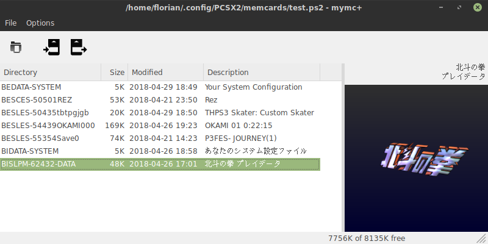

# PS2IODB Extractor 

PS2IODB Extractor is a PlayStation 2 memory card manager for use with `.ps2` files as created by the PCSX2 emulator.

This tool is based on [mymc+](https://sr.ht/~thestr4ng3r/mymcplus/) created by ~thestr4ng3r, which was based on the tool [mymc](http://www.csclub.uwaterloo.ca:11068/mymc/) created by Ross Ridge.

Thanks to the efforts of Ross Ridge and ~thestr4ng3r the code base comes with these benefits:
* Running on Python 3 and wxPython Phoenix.
* Cross-platform GUI and icon rendering using OpenGL 3.2 Core.
* Support for importing many save file types, including PSV files as made by the PS3.
* Added a pytest based test suite.
* Many other small refactorings...

Here is an overview of most features:

* Read and write the PS2 memory card file system, including extracting and adding files at file system level
* Import save games in MAX Drive (.max), EMS (.psu), SharkPort (.sps), X-Port (.xps), Code Breaker (.cbs) and PSV (.psv) format
* Export save games in MAX Drive (.max) and EMS (.psu) format
* Command line interface
* Optional wxPython based GUI, also displaying the 3D icons



# Installation 
TODO

## Usage

If the GUI component is installed (i.e. wxPython can be found), it can
simply be started using the following command:

```
mymc++
```

### Command Line Interface

The command line interface can be used like this:

```
Usage: /usr/bin/mymcplus [-ih] memcard.ps2 command [...]

Manipulate PS2 memory card images.

Supported commands:
   add: Add files to the memory card.
   check: Check for file system errors.
   clear: Clear mode flags on files and directories
   delete: Recursively delete a directory (save file).
   df: Display the amount free space.
   dir: Display save file information.
   export: Export save files from the memory card.
   extract: Extract files from the memory card.
   format: Creates a new memory card image.
   gui: Starts the graphical user interface.
   import: Import save files into the memory card.
   ls: List the contents of a directory.
   mkdir: Make directories.
   remove: Remove files and directories.
   set: Set mode flags on files and directories

Options:
  --version         show program's version number and exit
  -h, --help        show this help message and exit
  -i, --ignore-ecc  Ignore ECC errors while reading.
```

It is always necessary to specify the path to a memory card image
with `-i <path>` first. For example:

```
mymcplus -i empty.ps2 format
```

creates the file `empty.ps2` and formats it as an empty memory card.

## Contributing

Send bug reports or patches using [git send-email](https://git-send-email.io/)
to mymcplus@metallic.software.

## License

mymc+  
by Florian Märkl, based on mymc by Ross Ridge

This program is free software: you can redistribute it and/or modify  
it under the terms of the GNU General Public License as published by  
the Free Software Foundation, either version 3 of the License, or  
(at your option) any later version.

This program is distributed in the hope that it will be useful,  
but WITHOUT ANY WARRANTY; without even the implied warranty of  
MERCHANTABILITY or FITNESS FOR A PARTICULAR PURPOSE.  See the  
GNU General Public License for more details.

You should have received a copy of the GNU General Public License  
along with this program.  If not, see <https://www.gnu.org/licenses/>.
